# Architecture — retention-prediction

High-level data flow from the synthetic source mart through to the deployed
prediction artifact. v0.1 documents the *target* architecture; components
marked `[v0.1]` are built today, components marked `[Loop N]` are scaffolded
and ship in later loops.

---

## Data Flow

```mermaid
flowchart LR
    subgraph PaWarehouse["pa-warehouse-prod (BigQuery)"]
        direction TB
        Marts["marts dataset"]
        Features["marts.v_attrition_features<br/>(10 cols, synthetic 2,500 employees)"]
        Predictions["marts.v_attrition_predictions<br/>(writeback target, Loop 4)"]
        Marts --> Features
        Marts --> Predictions
    end

    subgraph RP["retention-prediction (this repo)"]
        direction TB
        Contract["docs/integration_contract.md<br/>+ docs/_schema_dump.py<br/>[v0.1]"]
        Loader["src/retention/data/load.py<br/>(pandas-gbq + cost cap)<br/>[Loop 1 — Story 1.1]"]
        FeatureCatalog["src/retention/features/<br/>FeatureSpec + preprocessing<br/>[Loop 1 — Story 1.2]"]
        Split["temporal train/val/test split<br/>[Loop 1 — Story 1.4]"]
        Models["src/retention/models/<br/>LR / XGBoost / EBM / RSF<br/>[Loop 1: XGB only; Loop 2: all]"]
        Eval["src/retention/evaluation/<br/>AUC-PR / cal / threshold / EV<br/>[Loop 1: AUC-PR; Loop 2: full]"]
        Fairness["src/retention/fairness/<br/>R2-recipe audit<br/>[Loop 3a]"]
        Explain["src/retention/explainability/<br/>SHAP / ALE / DiCE / EBM<br/>[Loop 3c]"]
        Writeback["src/retention/writeback/<br/>BigQuery writer<br/>[Loop 4]"]
        Notebooks["notebooks/01..05<br/>narrative cells importing from src/<br/>[Loops 1-4]"]
    end

    subgraph Distribution["Distribution"]
        direction TB
        LookerPage5["Looker Studio Page 5<br/>(in pa-warehouse dashboard)<br/>[Loop 4]"]
        Substack["Substack post<br/>[Loop 4]"]
        LinkedIn["LinkedIn demo video<br/>[Loop 4]"]
    end

    Features -- "pandas-gbq SELECT<br/>+ ORDER BY employee_id" --> Loader
    Loader --> FeatureCatalog
    FeatureCatalog --> Split
    Split --> Models
    Models --> Eval
    Models --> Fairness
    Models --> Explain
    Eval --> Writeback
    Writeback -- "BigQuery Data Editor<br/>+ schema-validated INSERT" --> Predictions
    Predictions --> LookerPage5
    Eval --> Notebooks
    Fairness --> Notebooks
    Explain --> Notebooks
    Notebooks --> Substack
    Notebooks --> LinkedIn
    Contract -. "schema validates against" .-> Loader
    Contract -. "schema validates against" .-> Features
```



### ASCII fallback

```
                                  ┌────────────────────────────────────────┐
                                  │ pa-warehouse-prod (BigQuery)           │
                                  │                                        │
                                  │   marts.v_attrition_features (READ)    │
                                  │           │                            │
                                  └───────────┼────────────────────────────┘
                                              │ pandas-gbq SELECT + ORDER BY
                                              ▼
   docs/_schema_dump.py            ┌────────────────────────────────────────┐
   docs/integration_contract.md ─→ │ src/retention/data/load.py     [v0.1+] │
   (schema contract)               │                ↓                       │
                                   │ src/retention/features/        [Loop1] │
                                   │     FeatureSpec + preprocessing        │
                                   │                ↓                       │
                                   │ temporal train/val/test split  [Loop1] │
                                   │                ↓                       │
                                   │ src/retention/models/                  │
                                   │   XGBoost (Loop 1) → +LR+EBM+RSF (L2)  │
                                   │                ↓                       │
                                   │ src/retention/evaluation/              │
                                   │   AUC-PR (L1) → +cal/EV/threshold (L2) │
                                   │                ↓                       │
                                   │     ┌──────────┴──────────┐            │
                                   │     │ fairness/ [Loop 3a] │            │
                                   │     │ explain/  [Loop 3c] │            │
                                   │     └──────────┬──────────┘            │
                                   │                ↓                       │
                                   │ src/retention/writeback/      [Loop 4] │
                                   │                ↓                       │
                                   └─────────────────────────┬──────────────┘
                                                             │ INSERT (Data Editor)
                                                             ▼
                                   ┌────────────────────────────────────────┐
                                   │ pa-warehouse-prod (BigQuery)           │
                                   │                                        │
                                   │   marts.v_attrition_predictions (WRITE)│
                                   │           │                            │
                                   └───────────┼────────────────────────────┘
                                               ▼
                                   ┌────────────────────────────────────────┐
                                   │ Looker Studio Page 5           [Loop 4]│
                                   │   (in pa-warehouse dashboard)          │
                                   └────────────────────────────────────────┘
```

---

## Component Boundaries

### Cross-project: `retention-prediction` ↔ `pa-warehouse`

The integration is **schema-contract-mediated**, not API-mediated:

- **`pa-warehouse`** owns the source mart (`marts.v_attrition_features`). When pa-warehouse changes the mart schema, it ships a new version of the columns.
- **`retention-prediction`** documents the schema it depends on in `docs/integration_contract.md` (regenerable via `docs/_schema_dump.py`). The loader (`src/retention/data/load.py`) validates against this contract at runtime (Story 1.1.8).
- **Drift detection** happens in two places:
  1. **At commit time** — running `python docs/_schema_dump.py` against the live mart and `git status` showing a diff means the contract has drifted.
  2. **At CI / test time** — Story 1.1.8 contract test asserts loader schema matches the contract file. Fails CI if drift is detected.

This is the same pattern dbt uses for source `freshness` checks but applied to schema instead of timeliness.

### Within `retention-prediction`: `src/` vs `notebooks/`

All logic lives in `src/retention/`. Notebooks are narrative-only:
- Each notebook imports from `src/retention/` (no `def` / `class` at notebook scope — enforced by `scripts/check_notebook_logic.py` pre-commit hook).
- Notebooks call functions, render plots, and add markdown commentary.
- This is the canonical "src layout" pattern senior reviewers grep for.

### Within `src/retention/`: subpackage responsibilities

| Subpackage | Responsibility | Loop |
|---|---|---|
| `data/` | BigQuery load + contract validation + CSV snapshot fallback | Loop 1 |
| `features/` | FeatureSpec dataclass + preprocessing pipeline | Loop 1 |
| `models/` | Model wrappers (LR / XGBoost / EBM / RSF / CoxPH) | Loop 1 (XGB), Loop 2+ |
| `evaluation/` | Metrics + calibration + threshold + EV + nested CV | Loop 1 (AUC-PR), Loop 2+ |
| `fairness/` | Fairlearn audit + compound-attribute + intervention-category | Loop 3a |
| `explainability/` | SHAP / ALE / DiCE / EBM intrinsic / SurvSHAP(t) | Loops 3b + 3c |
| `writeback/` | BigQuery writer + schema validation | Loop 4 |
| `config.py` (module, not subpackage) | SEED + paths + BigQuery names + reproducibility scaffold + visual design | Loop 1 ✅ |

**No `causal/` subpackage** — Epic 7 is CUT from v1.0 per the r03 hunt review. Held for v1.1 only if reviewer feedback requests causal reasoning.

---

## Reproducibility Model

Three layers of determinism, each with a documented envelope:

1. **In-process RNG** — `retention.config.set_global_seed()` seeds `random` and `numpy` for the current Python process. Sufficient for sklearn / xgboost / lightgbm reproducibility.
2. **Hash randomization** — `PYTHONHASHSEED` is exported to `os.environ` for child processes (multiprocessing, xgboost `n_jobs>1`). **Current-process hash randomization is NOT controlled at runtime** — the invoker must set `PYTHONHASHSEED=42` before `uv run`. The Makefile's `repro` target does this.
3. **Dependency lock** — `uv.lock` pins all 279 transitive dependencies to exact versions. A fresh-clone reviewer running `uv sync` gets the same package versions, byte-for-byte.

Story 2.8 (Loop 2) adds a full reproducibility smoke test that verifies all three layers end-to-end: same code + same data + same lockfile + same seeds → same metrics to 5 decimals.

---

## What's Built at v0.1

```
✅ Public GitHub repo with CI green (lint + test workflows on Ubuntu × Python 3.11 + 3.12)
✅ uv-managed environment (17 core + 8 dev deps, lockfile committed)
✅ src/retention/ package skeleton (8 modules, including config.py)
✅ Reproducibility + colorblind visual scaffolding (Story 0.2.9)
✅ Integration contract documented + regenerable (docs/_schema_dump.py)
✅ Install gates passed (survshap 🔴, alibi 🟡)
✅ Pre-commit hooks (ruff + mypy --strict + nbstripout + notebook-logic + detect-secrets)
✅ 6 behavior tests + nbmake-runnable environment notebook
✅ Cross-platform service-account key resolution (env-overridable)
```

## What's Deferred

```
⏳ Story 1.1 — BigQuery loader (Loop 1, next)
⏳ Story 1.2 — FeatureSpec dataclass with extended schema (Loop 1)
⏳ Story 1.4 — Temporal train/val/test split (Loop 1)
⏳ Story 2.3 — XGBoost training (Loop 1)
⏳ Story 3.1 — AUC-PR metric (Loop 1)
⏳ All Loop 2 / 3a / 3b / 3c / 4 work — see BACKLOG.md
```

---

## Why This Architecture (vs alternatives)

| Choice | Alternative considered | Why we picked this |
|---|---|---|
| `src/` layout + thin notebooks | Single-notebook repo (IBM-tutorial style) | G1 anti-pattern: most public HR repos fail code review at "logic in notebooks." `src/` layout is grep-able senior signal. |
| Schema contract in markdown + script | OpenAPI / Protobuf | Markdown is the audience format — readers don't need to install a tool to grok the schema. Script regenerates from live BQ. |
| pandas-gbq + CSV fallback | Polars / Arrow direct | pandas is the lingua franca. CSV fallback covers offline reproducibility. Polars revisit is a Loop 4 perf concern, not a Loop 1 blocker. |
| MLflow with local file store | Hosted MLflow / W&B | Most JDs ask for MLflow; hosted servers add infra without portfolio signal. Local file store + screenshot is enough. |
| Tree-based models only (no DL) | TabNet / NODE / SAINT | Settled science on tabular data (Grinsztajn 2022 et al). README documents the non-choice with citations. |
| Threshold calibration over SMOTE | SMOTE + class weights | R1 [FLIP-RISK]: SMOTE distorts calibration. Framed as controlled experiment per Story 3.3. |

---

_See `BACKLOG.md` for the full risk register, stack decisions, and loops overview. See `docs/integration_contract.md` for the column-level schema this architecture depends on._
